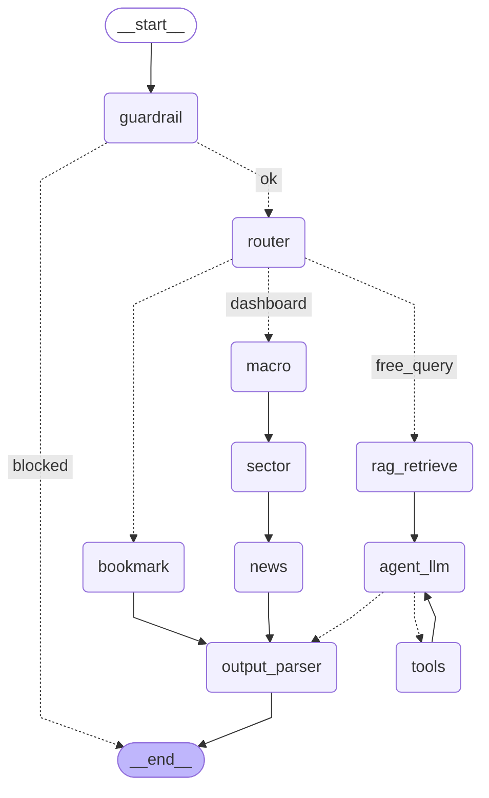

# LangChain 기반 Agent 서비스 구현 — 프로젝트 보고서

- 프로젝트명: Trading Agent — 마켓 브리핑 + 자연어 리서치 어시스턴트
- 제출 리포지토리 경로: 본 레포지토리 루트
- 작성일: 2026-07-12 (UI 개편 및 버그 수정 반영본)

## 1. 프로젝트 개요

### 1.1 배경 및 목적

투자자가 매일 아침 확인하는 "매크로 지표 / 주도 섹터 / 시장 반응(뉴스)"을 한 화면에서
보여주는 동시에, 궁금한 내용을 자연어로 바로 물어볼 수 있는 서비스가 필요하다는 문제
의식에서 출발했다. 기존의 단순 대시보드는 정형화된 지표만 보여주고, 단순 챗봇은 실시간
시장 데이터에 접근하지 못한다는 한계가 있다. 이 프로젝트는 LangGraph 기반 Agent를
사용해 두 가지를 하나의 서비스로 통합했다.

### 1.2 핵심 아이디어

1. **고정 정보(대시보드)**: 매크로 지표·주도 섹터·뉴스 센티먼트를 Tool 호출로 가져와
   구조화된 카드로 표시.
2. **자유 탐색(자연어 질의)**: Agent가 상황에 맞는 Tool을 스스로 선택해 호출하고, RAG로
   축적된 지식을 참고해 답변.
3. **개인화(북마크)**: 사용자가 저장한 답변이 벡터스토어에 즉시 적재되어, 이후 유사한
   질문에 근거 자료로 재사용됨.

## 2. 서비스 사용 시나리오

1. 사용자가 앱에 접속하면 대시보드가 자동으로 매크로/섹터/뉴스 정보를 새로고침한다.
   화면 최상단에는 그날의 핵심을 한 줄로 요약한 **[브리핑]** 헤드라인이 굵은 글씨로
   먼저 노출된다 (예: "Materials 섹터 강세, S&P500 지수 상승중 (+0.42%).").
2. 매크로 지표는 현재 값 옆에 **최근 10거래일 추세 스파크라인**이 함께 표시되어, "오늘
   등락률이 무엇을 기준으로 계산된 것인지" 숫자 하나만으로는 알기 어렵던 문제를 실제
   추이 그래프로 보완했다.
3. 화면 우하단의 💬 플로팅 버튼을 누르면 채팅 패널이 대시보드 위에 팝업으로 뜬다.
   여기서 "지금 반도체 섹터 왜 이래?"처럼 자유롭게 질문한다.
4. Agent가 `search_market_news`, `get_sector_performance` 등 필요한 Tool을 스스로
   호출해 근거를 수집하고, RAG로 검색된 과거 뉴스/북마크를 참고해 답변한다.
5. 실제 정보가 담긴 답변에는 🔖 버튼이 붙는다 (저장 확인 메시지·가드레일 차단 메시지
   등 시스템 응답에는 버튼이 붙지 않도록 필터링했다). 버튼을 누르면 벡터스토어에 즉시
   적재된다.
6. 이후 비슷한 질문을 하면 방금 북마크한 내용이 검색 결과에 포함되어 더 일관된 답을
   받는다 (개인화 RAG 루프).

## 3. 시스템 아키텍처

```
Streamlit UI (app/streamlit_app.py)
   ├─ 상단: [브리핑] 헤드라인 + 매크로/섹터/뉴스 "가로로 긴 카드" 3개 (세로로 쌓임)
   └─ 우하단: 💬 플로팅 버튼 → 대시보드 위 오버레이 채팅 패널 (멀티턴 + 북마크 버튼)
        │
        │  run_turn(user_text, thread_id)
        ▼
LangGraph StateGraph (app/graph/builder.py)
   guardrail → router ─┬─ dashboard  → macro → sector → news ─┐
                        ├─ bookmark   → bookmark ──────────────┤
                        └─ free_query → rag_retrieve → agent_llm ⇄ tools ─┘
                                                                 │
                                                          output_parser → END
        │
        ▼
SqliteSaver(세션별 대화 상태) + Chroma(뉴스/북마크 벡터스토어)
```

### 3.1 Workflow 다이어그램 (`get_graph().draw_mermaid()` 실제 추출)



**조건부 분기 2곳 + 반복 루프 1곳**
- `guardrail` → `blocked`(즉시 종료) / `ok`(라우터로) — 조건부 분기 #1
- `router` → `dashboard` / `bookmark` / `free_query` 3분기 — 조건부 분기 #2
- `agent_llm ⇄ tools` — LLM이 도구 호출을 원하는 동안 반복되는 ReAct 루프

## 4. 상세 구현 내용

### 4.1 Tool (4종, 요구사항 최소 2개 대비 2배)

| Tool | 데이터 소스 | 용도 |
|---|---|---|
| `get_macro_indicators` | yfinance (^GSPC, ^VIX, ^TNX, DX-Y.NYB) | 매크로 지표 + 최근 10거래일 추세 |
| `get_sector_performance` | yfinance (S&P500 11개 GICS 섹터 SPDR ETF) | 주도 섹터 |
| `search_market_news` / `fetch_finance_headlines` | Tavily 웹 검색 (금융 매체 도메인 제한) | 뉴스/시장 반응 |
| `get_stock_quote` | yfinance (개별 종목) | 자유 질의 전용 (예: "삼성전자 지금 어때?") |

자유 질의 흐름([app/graph/nodes/agent.py](../app/graph/nodes/agent.py))에서는 4개
Tool을 모두 `bind_tools()`로 LLM에 노출하고, LLM이 상황에 맞게 스스로 호출 여부와
인자를 결정한다 (LangGraph 공식 ReAct 패턴).

**뉴스 검색 도메인 제한**: 초기에는 Tavily의 `topic="finance"` 파라미터만 믿고
한국어 질의("오늘 미국 증시 시황 및 주요 뉴스")로 검색했는데, 폭염·집중호우·경찰 수사
같은 일반 뉴스가 대시보드에 섞여 들어오는 문제를 실제로 겪었다. 원인은 `topic` 필터가
강제 제외가 아니라 느슨한 가중치에 가깝다는 점이었다. [news_tool.py](../app/tools/news_tool.py)에
`fetch_finance_headlines()`를 별도로 만들어, 대시보드용 검색은 `include_domains`로
Yahoo Finance·Reuters·Bloomberg·CNBC 등 검증된 금융 매체로 강제 제한하고 쿼리도
영어로 바꿔 해결했다 (자유 질의용 `search_market_news`는 특정 종목 질문에서 범위를
좁히면 답을 놓칠 수 있어 도메인 제한을 걸지 않았다).

### 4.2 RAG 파이프라인

- **적재**: 대시보드 뉴스 검색 결과([ingest_news_articles](../app/rag/ingest.py))와
  사용자 북마크([ingest_bookmark](../app/rag/ingest.py))를 같은 Chroma 컬렉션에 적재.
- **검색**: [retrieve_context](../app/rag/retriever.py)가 사용자 질의로 유사도 검색 →
  상위 4개 문서를 프롬프트 컨텍스트로 주입.
- **응답 반영**: `agent_llm` 노드의 시스템 프롬프트에 RAG 컨텍스트가 포함되어 실제
  답변 생성에 반영된다.
- **검증**: 실제 실행 테스트에서 "기술 섹터 강세 이유"를 북마크 → 이후 동일 주제
  재질의 시 새 Tool 호출 없이(`used_tools: []`) 북마크 내용만으로 일관된 답변을
  생성하는 것을 확인했다 (개인화 RAG 루프 작동 증거).

### 4.3 메모리 / 상태 관리

- **단기(세션) 기억**: LangGraph `SqliteSaver`([app/memory/checkpointer.py](../app/memory/checkpointer.py))가
  `thread_id` 기준으로 `messages` 등 State를 영속화 → 멀티턴 대화 유지.
- **대시보드 전용 공유 스레드**: 대시보드는 사용자마다 다를 이유가 없는 공용 데이터라
  별도의 고정 `thread_id`(`shared-dashboard`)를 쓰고, `st.cache_data(ttl=300)`으로
  Streamlit 프로세스 전체에서 결과를 공유한다. 브라우저 탭이 몇 개든 5분 내에는
  실제 API 호출이 한 번만 발생하도록 설계했다.
- **장기(개인화) 기억**: 북마크가 쌓이는 Chroma 벡터스토어. 세션이 끝나도 유지된다.
- **State 잔존 버그 수정**: LangGraph 체크포인터는 노드가 반환하지 않은 키를 이전
  값 그대로 유지한다. 이 특성 때문에, 한 번이라도 `state["error"]`가 채워지면 이후
  실행이 전부 성공해도 그 값을 아무도 지우지 않아 예전 에러가 화면에 계속 재노출되는
  버그를 실제로 겪었다. 그래프 맨 앞에서 항상 실행되는 `guardrail` 노드가 매 턴 시작
  시 `error`를 `None`으로 리셋하도록 고쳐서 해결했다 ([guardrail.py](../app/graph/middleware/guardrail.py)).
  아울러 Streamlit 쪽 `st.cache_data`도 실패한 결과를 TTL 끝까지 캐싱해 같은 문제를
  키우고 있어, 에러가 감지되면 즉시 캐시를 비우도록 함께 고쳤다.

### 4.4 Middleware

| 종류 | 파일 | 설명 |
|---|---|---|
| 입력 검증/가드레일 | [guardrail.py](../app/graph/middleware/guardrail.py) | 빈 입력·과도한 길이·프롬프트 인젝션 패턴 차단 + 매 턴 `error` 상태 리셋 |
| 속도 제한 | [rate_limiter.py](../app/graph/middleware/rate_limiter.py) | 세션당 60초 내 요청 수 제한 |
| 로깅 | [logging_mw.py](../app/graph/middleware/logging_mw.py) | 모든 노드의 진입/종료/소요시간 구조화 로그 |
| 예외 처리 | [error_handler.py](../app/graph/middleware/error_handler.py) | 노드 실행 중 예외를 흡수해 그래프 중단 대신 `state["error"]`로 전환 |

로깅/예외처리는 [app/graph/builder.py](../app/graph/builder.py)의 `_wrapped()` 헬퍼가
모든 노드 등록 시 데코레이터로 일괄 적용한다. 실제 운영 중 여러 차례의 API quota
초과(429) 상황에서 이 미들웨어가 그래프를 죽이지 않고 `state["error"]`로 안전하게
전환하는 것을 실제 장애 상황에서 반복적으로 확인했다.

### 4.5 OutputParser (구조화 출력)

`llm.with_structured_output(PydanticModel)` 패턴을 3곳에서 사용한다
([app/schemas/models.py](../app/schemas/models.py)).

| 지점 | 모델 | 용도 |
|---|---|---|
| `router` | `RouteDecision` | 사용자 의도 분류 → 조건부 분기 판단 근거 |
| `news` | `MarketSentimentSnapshot` | 기사별 감성 판단(한국어 요약 포함) → 구조화 |
| `output_parser` | `AgentAnswer` | 자유 질의 최종 답변(answer/sources/used_tools) 구조화 |

`macro`/`sector` 노드는 반대로 숫자 필드는 Tool 결과를 그대로 신뢰하고 LLM에게는
해설 문장만 맡긴다 — 구조화 출력을 "언제 쓰고 언제 안 쓰는지"를 의도적으로 대비시켜
설계 근거를 코드 주석에 남겼다. `MacroSnapshot`에는 최근 10거래일 종가 리스트
(`sp500_history` 등)도 추가해, 프론트에서 스파크라인을 그릴 수 있게 했다.

### 4.6 LLM Provider 구성과 장애 대응

개발/검증 과정에서 여러 Provider(Google Gemini, OpenAI, OpenRouter)를 실제로 전환하며
테스트했고, 그 경험을 바탕으로 [app/llm.py](../app/llm.py)에 아래 구조를 구현했다.

- `LLM_PROVIDER` 환경변수로 `google` / `openai` / `openrouter` 중 선택.
- `with_fallback()` 헬퍼 — LangChain의 `Runnable.with_fallbacks()`를 이용해 주 모델
  호출이 실패(rate limit 등)하면 자동으로 보조 모델 체인으로 전환한다. 개발 중
  OpenRouter의 무료 모델(`qwen/qwen3-coder:free`)이 업스트림에서 자주 rate-limit에
  걸리는 것을 확인하고 추가한 안전장치이며, `bind_tools`/`with_structured_output`
  이후에 `.with_fallbacks()`를 적용해 두 Provider 모두에서 동일한 체인 형태가
  유지되도록 구성했다.
- 최종 제출 시점 기본 Provider는 **OpenAI**(`gpt-4o-mini` + `text-embedding-3-small`)로
  확정했다 — Gemini 무료 티어의 일일 quota(모델당 20회)가 개발/시연 중 반복적으로
  소진되는 것을 겪은 뒤 내린 결정이며, Gemini/OpenRouter 연동 코드는 그대로 남겨
  `.env`의 `LLM_PROVIDER` 값만 바꾸면 즉시 전환 가능하다.
- **Provider 전환 시 임베딩 재인덱싱 필요성 발견**: Google(3072차원)↔OpenAI(1536차원)
  임베딩을 오가며 테스트하다 Chroma 컬렉션의 벡터 차원 불일치 오류를 실제로 겪었다.
  임베딩 모델을 바꾸면 기존 벡터스토어(`data/chroma`)를 반드시 재생성해야 한다는
  점을 확인하고 한계점에 반영했다.

### 4.7 프론트엔드 UI/UX (Streamlit)

사용자 피드백을 반영해 여러 차례 반복 개선했다.

1. **다크 테마 일원화**: `.streamlit/config.toml`에 `base="dark"` 테마를 명시해,
   커스텀 카드뿐 아니라 버튼·입력창·경고 배너 등 Streamlit 기본 위젯의 텍스트 색상까지
   일관되게 다크 톤으로 맞췄다 (초기에는 카드만 다크로 스타일링해서 기본 위젯과
   색상이 안 맞는 문제가 있었다).
2. **[브리핑] 헤드라인**: 매크로/섹터 데이터를 조합해 "{주도 섹터} 섹터 강세, S&P500
   지수 {상승/하락}중" 형태의 한 줄 요약을 카드 위에 굵게 표시 (`render_briefing()`).
3. **카드 레이아웃 — "가로로 긴 카드 3개를 세로로 쌓기"**: 처음에는 3개 카드를
   `st.columns(3)`로 나란히 배치했으나, 화면 폭이 좁으면 자동으로 세로 스택되는
   Streamlit 기본 반응형 동작이 사용자 의도와 달랐다. 최종적으로는 `st.columns`를
   쓰지 않고 카드 3개(매크로/섹터/뉴스)를 화면 폭 전체를 쓰는 넓은 카드로 만들어
   위에서 아래로 순서대로 쌓았다. 각 카드 내부 콘텐츠(게이지/섹터 칩/뉴스 칩)는
   `grid-template-columns: repeat(auto-fit, minmax(...))` CSS로 한 줄에 최대한
   나란히 배치되게 해서, 넓어진 카드 폭을 낭비하지 않도록 했다.
4. **매크로 지표 시각화 — 스파크라인 추세 차트**: 처음에는 값+등락률 텍스트만
   보여주다가, "게이지 바"(정상 범위 대비 위치 표시)를 거쳐 최종적으로는 최근
   10거래일 종가를 순수 SVG로 그린 **스파크라인**으로 바꿨다. `get_macro_indicators`
   Tool이 `fetch_recent_history()`로 각 지표의 최근 10일치 종가를 함께 반환하고,
   `MacroSnapshot`에 `*_history` 필드로 실려 프론트까지 전달된다. 외부 차트
   라이브러리(Plotly 등) 없이 인라인 SVG 문자열로 그려서 의존성/로딩 비용을 늘리지
   않았다.
5. **뉴스 한국어화**: `news` 노드의 LLM 프롬프트에 "summary/commentary 필드는 반드시
   한국어로 작성"을 명시해, 원문이 영어 기사여도 카드에는 한국어 요약과 감성 라벨
   (긍정/중립/부정)이 표시되도록 했다.
6. **플로팅 채팅 위젯**: 별도 탭으로 분리했던 "리서치 어시스턴트"를, 우하단 💬 버튼을
   눌러야 뜨는 팝업형 위젯으로 다시 바꿨다. Streamlit에는 네이티브 모달이 없어서,
   `st.container(key="chat_panel")`이 생성하는 `st-key-chat_panel` CSS 클래스를
   `position: fixed`로 오버라이드하는 방식으로 구현했다. 패널 내부에서는
   `st.chat_input`이 항상 브라우저 최하단에 고정되는 특성 때문에 대신
   `st.form` + `st.text_input`을 사용해 패널 안에 완전히 가뒀다.
7. **북마크 버튼 필터링**: 처음에는 모든 assistant 메시지에 북마크 버튼이 붙어서,
   "북마크 저장했습니다" 확인 메시지 자체에도 버튼이 뜨는 문제가 있었다. 메시지가
   `🔖`/`⚠️`로 시작하면(저장 확인·가드레일 차단) 버튼을 숨기도록 필터링했다.

## 5. 평가항목 대응 요약

| 평가 항목 | 배점 | 대응 |
|---|---|---|
| 문제 정의 및 서비스 기획 | 10 | 2장 시나리오, 대시보드+자유탐색+북마크 통합 설계 |
| Agent 설계 (LangGraph) | 20 | 3장 — 조건부 분기 2곳, ReAct 반복 루프 1곳 |
| Tool 활용 | 15 | 4.1 — Tool 4종, 도메인 제한 뉴스검색 포함 실제 API 연동 검증 완료 |
| RAG 구현 | 15 | 4.2 — 적재/검색/응답반영 + 개인화 루프 실증 |
| 메모리/상태 관리 | 10 | 4.3 — 세션 메모리 + 공유 캐시 + 장기 기억 + state 잔존 버그 수정 |
| Middleware 적용 | 10 | 4.4 — 가드레일/속도제한/로깅/예외처리 4종 |
| 코드 품질 | 10 | 노드·툴·RAG·미들웨어·UI 모듈 분리, 설계 근거 주석화 |
| 문서화 | 10 | README + 본 보고서 + mermaid 다이어그램 |

## 6. 검증 및 테스트 결과

개발 과정에서 CLI(`python -m app.main`)와 실제 Streamlit 서버를 통해 전체 흐름을
End-to-End로 검증했다.

- **대시보드 흐름**: 실제 yfinance/Tavily 데이터로 macro→sector→news 노드가 정상
  동작함을 확인 (예: S&P500 7,575.4 (+0.42%), 주도 섹터 Materials +1.25%).
- **매크로 히스토리**: `get_macro_indicators` 직접 호출로 `sp500_history`에 실제
  10거래일치 종가(7354.0 ~ 7575.4)가 정확히 채워지는 것을 확인했다.
- **자유 질의 ReAct 루프**: "기술 섹터가 강세인 이유", "삼성전자 지금 어때?" 등의
  질문에 `get_sector_performance`, `search_market_news`, `get_stock_quote`를
  자율적으로 호출해 근거 있는 답변(실시간 시세 포함)을 생성하는 것을 확인.
- **개인화 RAG 루프**: 답변을 북마크 → 후속 질문에서 Tool 재호출 없이 북마크
  내용만으로 답변하는 것을 확인.
- **미들웨어(예외 처리)**: API quota 초과(429) 상황에서 `error_handler`가 예외를
  흡수해 `state["error"]`로 전환하고, Streamlit 화면에 경고 배너로 노출되는 것을
  실제 장애 상황에서 확인. 이후 이 상태가 다음 턴까지 잘못 이어지는 버그도 발견해
  수정하고 재검증했다.
- **뉴스 도메인 제한 검증**: 수정 전/후 비교 — 수정 전에는 폭염·경찰수사 등 일반
  뉴스가 섞였고, `fetch_finance_headlines()` 적용 후에는 전량 Yahoo
  Finance/Investing.com 등 금융 매체 기사만 반환되는 것을 실제 호출로 확인.
- **세션 캐싱 효과**: 캐싱 적용 전에는 브라우저 탭 여러 개가 각각 대시보드를
  새로고침해 API 호출이 중복 발생하는 문제를 실측했고, `st.cache_data(ttl=300)` +
  공유 `thread_id` 적용 후 로그에서 탭 수와 무관하게 호출이 1회로 줄어드는 것을
  확인했다.

## 7. 한계점 및 향후 개선 방향

- **매크로 지표가 공식 통계(FRED 등)가 아닌 시장 프록시(yfinance)**: CPI·실업률 등
  진짜 거시 지표는 발표 주기가 느리고 별도 API 키가 필요해 이번 범위에서는 제외했다.
- **섹터 데이터가 미국(S&P500 SPDR ETF) 기준**: 한국 시장 섹터 데이터는 소스가
  불안정해 미국 시장을 기본으로 했다. 개별 종목 조회는 한국 종목도 지원한다.
- **Rate limiter가 프로세스 메모리 기반**: 다중 인스턴스 배포 시 세션별 요청 수가
  인스턴스마다 따로 카운트된다. 실서비스 전환 시 Redis 등 외부 저장소 교체가 필요.
- **가드레일이 키워드 매칭 수준**: 정교한 프롬프트 인젝션 탐지에는 한계가 있다.
- **뉴스 노드의 임베딩 적재 지연**: 청크 단위 순차 임베딩 호출로 대시보드 새로고침이
  느려질 수 있다 (배치 임베딩/캐싱으로 개선 여지).
- **LLM Provider별 무료 티어 quota 편차**: 계정/모델에 따라 일일 요청 한도가 크게
  달라(예: Gemini 20회/일) 실제 서비스 안정성에 영향을 준다 — `with_fallback()`으로
  일부 완화했으나, 실서비스라면 유료 플랜/자체 rate budget 관리가 필요하다.
- **Provider 전환 시 벡터스토어 재인덱싱 필요**: 임베딩 모델을 바꾸면 기존 Chroma
  컬렉션과 차원이 맞지 않아 `data/chroma`를 삭제하고 다시 쌓아야 한다. 자동 감지 후
  재인덱싱하는 로직은 아직 없다.
- **뉴스 도메인 allowlist가 고정 목록**: `_FINANCE_DOMAINS`가 하드코딩돼 있어, 새
  매체를 추가하려면 코드 수정이 필요하다.

## 8. 결론

이 프로젝트는 LangGraph의 StateGraph를 이용해 "고정 정보 대시보드"와 "자율적
Tool-calling Agent"를 하나의 그래프 안에서 조건부 분기로 통합했고, RAG와 세션
메모리, 미들웨어를 실제 장애 상황(quota 초과, 임베딩 차원 불일치, 세션 중복 호출,
state 잔존 버그, 뉴스 주제 이탈)을 겪으며 검증·보완했다. UI 역시 사용자 피드백을
반복 반영해 탭 기반 레이아웃에서 브리핑 헤드라인 + 가로로 긴 카드 스택 + 스파크라인
차트 + 플로팅 챗봇 위젯 형태로 발전시켰다. 평가 기준의 요구사항(Tool 2개 이상, RAG
1개 이상, 멀티턴 메모리, 조건부 분기 포함 StateGraph, Middleware, OutputParser)을
모두 충족하며, 일부는 요구 수준을 상회하는 형태(Tool 4종, OutputParser 3개 지점,
Middleware 4종)로 구현했다.
